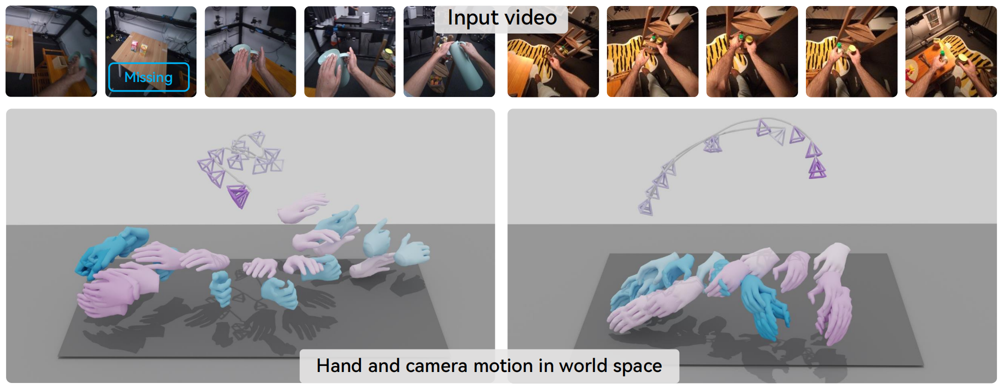

<div align="center">

# HaWoR: World-Space Hand Motion Reconstruction from Egocentric Videos

[Jinglei Zhang]()<sup>1</sup> &emsp; [Jiankang Deng](https://jiankangdeng.github.io/)<sup>2</sup> &emsp; [Chao Ma](https://scholar.google.com/citations?user=syoPhv8AAAAJ&hl=en)<sup>1</sup> &emsp; [Rolandos Alexandros Potamias](https://rolpotamias.github.io)<sup>2</sup> &emsp;  

<sup>1</sup>Shanghai Jiao Tong University, China
<sup>2</sup>Imperial College London, UK <br>

<font color="blue"><strong>CVPR 2025 Highlight✨</strong></font> 

<a href='https://arxiv.org/abs/2501.02973'></a> 
<a href='https://arxiv.org/pdf/2501.02973'></a> 
<a href='https://hawor-project.github.io/'></a> 
<a href='https://github.com/ThunderVVV/HaWoR'></a> 
<a href='https://huggingface.co/spaces/ThunderVVV/HaWoR'></a>
</div>

This is the official implementation of **[HaWoR](https://hawor-project.github.io/)**, a hand reconstruction model in the world coordinates:



## Installation
 
### Installation
```
git clone --recursive https://github.com/ThunderVVV/HaWoR.git
cd HaWoR
```

The code has been tested with PyTorch 1.13 and CUDA 11.7. Higher torch and cuda versions should be also compatible. It is suggested to use an anaconda environment to install the the required dependencies:
```bash
conda create --name hawor python=3.10
conda activate hawor

pip install torch==1.13.0+cu117 torchvision==0.14.0+cu117 --extra-index-url https://download.pytorch.org/whl/cu117
# Install requirements
pip install -r requirements.txt
pip install pytorch-lightning==2.2.4 --no-deps
pip install lightning-utilities torchmetrics==1.4.0
```

### Install masked DROID-SLAM:

```
cd thirdparty/DROID-SLAM
python setup.py install
```

Download DROID-SLAM official weights [droid.pth](https://drive.google.com/file/d/1PpqVt1H4maBa_GbPJp4NwxRsd9jk-elh/view?usp=sharing), put it under `./weights/external/`.

### Install Metric3D

Download Metric3D official weights [metric_depth_vit_large_800k.pth](https://drive.google.com/file/d/1eT2gG-kwsVzNy5nJrbm4KC-9DbNKyLnr/view?usp=drive_link), put it under `thirdparty/Metric3D/weights`.

### Download the model weights

```bash
wget https://huggingface.co/spaces/rolpotamias/WiLoR/resolve/main/pretrained_models/detector.pt -P ./weights/external/
wget https://huggingface.co/ThunderVVV/HaWoR/resolve/main/hawor/checkpoints/hawor.ckpt -P ./weights/hawor/checkpoints/
wget https://huggingface.co/ThunderVVV/HaWoR/resolve/main/hawor/checkpoints/infiller.pt -P ./weights/hawor/checkpoints/
wget https://huggingface.co/ThunderVVV/HaWoR/resolve/main/hawor/model_config.yaml -P ./weights/hawor/
```
It is also required to download MANO model from [MANO website](https://mano.is.tue.mpg.de). 
Create an account by clicking Sign Up and download the models (mano_v*_*.zip). Unzip and put the hand model to the `_DATA/data/mano/MANO_RIGHT.pkl` and `_DATA/data_left/mano_left/MANO_LEFT.pkl`. 

Note that MANO model falls under the [MANO license](https://mano.is.tue.mpg.de/license.html).
## Demo

### Single Video Inference

For visualizaiton in world view, run with:
```bash
python demo.py --video_path ./example/video_0.mp4  --vis_mode world
```

For visualizaiton in camera view, run with:
```bash
python demo.py --video_path ./example/video_0.mp4 --vis_mode cam
```

### Batch Inference (Multi-GPU)

For processing multiple videos in parallel across multiple GPUs:

```bash
# Process videos from a directory using 8 GPUs
python scripts/batch_infer.py \
  --video_dir /path/to/videos \
  --gpus 0,1,2,3,4,5,6,7

# Process videos from a list file (decord on-the-fly decode, fallback to opencv if decord unavailable)
python scripts/batch_infer.py \
  --video_list videos.txt \
  --gpus 0,1,2,3,4,5,6,7

# Custom configuration with retries
python scripts/batch_infer.py \
  --video_dir /path/to/videos \
  --gpus 0,1,2,3 \
  --retries 3 \
  --stages detect_track,motion,slam,infiller
```

**Key features:**
- Stage-wave scheduling across multiple GPUs with long-lived per-GPU runtimes
- Dynamic load balancing within each stage wave
- Automatic resume from existing outputs (use `--no-resume` to force rerun)
- Per-stage retry logic (default: `--retries`, or `--max_stage_retries` if set)
- Structured logging and progress tracking in `batch_runs/<timestamp>/`
- Stable stage order: `detect_track → motion → slam → infiller`

**Output structure:**
```
batch_runs/<timestamp>/
├── status.json          # Current status of all videos
├── events.jsonl         # Event stream (start/success/fail/retry)
└── logs/
    ├── video1_detect_track.log
    ├── video1_motion.log
    └── ...
```

To resume an interrupted batch:
```bash
python scripts/batch_infer.py \
  --video_list videos.txt \
  --gpus 0,1,2,3,4,5,6,7 \
  --run_dir batch_runs/20260301_120000  # specify existing run directory
```

## Dataset Production Pipeline

The repo now includes a production dataset pipeline for:

- source-specific preprocess
- frozen clip manifest generation
- HaWoR stage inference across split runtimes
- clip-level language/annotation sidecars
- final VLA WebDataset build
- run validation

Primary entrypoints:

- `python scripts/run_dataset_pipeline.py --config ...`
- `python scripts/build_clip_manifest.py ...`
- `python scripts/build_vla_from_manifest.py ...`
- `python scripts/validate_pipeline_run.py ...`

Built-in dataset adapters:

- `buildai`
- `image_sequence`
- `video_folder`

### Adding A New Dataset

The pipeline is adapter-driven. A new dataset should normally require:

- one dataset adapter under `lib/pipeline/datasets/`
- one YAML config under `configs/`
- optional preprocess and annotation bridge scripts

The stable handoff is the frozen clip manifest. Your adapter should convert the source dataset into standard `ClipDescriptor` records, and everything downstream reuses the same stage/build/validate pipeline.

Minimum checklist for a new dataset:

- Decide the clip unit.
  Each manifest row must represent one complete clip/episode.
- Decide the frame storage mode.
  The built-in pipeline currently supports `tar_shard` and `image_sequence`.
- Define a stable `clip_id`.
  It must be unique across the dataset and stable enough to be reused by stage outputs and annotation sidecars.
- Define `seq_folder`.
  This is where `detect_track`, `motion`, `slam`, and `infiller` will write outputs for the clip.
- Map source metadata into the manifest.
  Keep dataset-specific information in `metadata` or `descriptor.extra`, not in downstream stage logic.
- If language annotation is needed, write sidecars to `<annotation_root>/<clip_id>.annotation.json`.

### Adapter Interface

Each dataset adapter plugs into the pipeline through a small interface:

- `prepare(...)`
  Optional source-specific preprocess step.
- `build_descriptors(...)`
  Required. Returns the canonical clip descriptors used to build the frozen manifest.
- `resolve_annotation_context(...)`
  Optional. Supplies adapter-specific inputs for the annotation stage command.
- `validate_source(...)`
  Optional. Performs dataset-specific source checks before or during pipeline validation.

In practice, a new dataset should usually only need a new adapter class plus one config file. The orchestrator, batch inference, final build, and validation code should not need dataset-specific edits.

### Final Outputs

After the whole pipeline finishes, the main outputs are:

- `clip_manifest.jsonl`
  Frozen list of clips used by all downstream stages.
- Per-clip `seq_folder` outputs
  Stage artifacts such as `tracks_*_*`, `SLAM/...`, and `world_space_res.pth`.
- Annotation sidecars
  One `<clip_id>.annotation.json` per clip when language annotation is enabled.
- Final VLA WebDataset shards
  `.tar` files containing image bytes, lowdim features, and metadata including `clip_id`, `instruction`, `instruction_num`, `language`, and `presence`.
- Validation summary
  Checks for source coverage, stage completeness, annotation validity, and final dataset schema.

Typical end state:

```text
<run_dir>/
  clip_manifest.jsonl
  shard_dirs.txt                # optional, for shard-based sources
  preprocess.log
  manifest.log
  detect_motion.log
  slam.log
  infiller.log
  annotate.log
  build.log
  validate.log

<annotation_root>/
  <clip_id>.annotation.json
  ...

<final_dataset_root>/
  shard-000000.tar
  shard-000001.tar
  ...
```

The recommended annotation format is one sidecar per clip:

- `<annotation_root>/<clip_id>.annotation.json`

with normalized fields:

- `status`
- `language`
- `instruction`
- optional `hierarchy`

Example configs:

- `configs/dataset_pipeline_buildai.example.yaml`
- `configs/dataset_pipeline_image_sequence.example.yaml`
- `configs/dataset_pipeline_video_folder.example.yaml`

Detailed storage contracts, runtime split, and smoke-test procedure are documented in [`docs/dataset_pipeline.md`](docs/dataset_pipeline.md).

## Repository Layout

The repository is organized so CLI entrypoints stay stable while reusable pipeline logic lives under `lib/pipeline`.

- `lib/pipeline/stages/`: canonical implementations for `detect_track`, `motion`, `infiller`, and `slam`
- `lib/pipeline/batch/`: batch-inference scheduler, state tracking, events, and worker orchestration
- `lib/pipeline/stage_api.py`: shared task/config/validation layer for batch and pipeline orchestration
- `lib/pipeline/exporters/`: dataset/export code, including the WebDataset builder
- `scripts/`: stable user-facing entrypoints such as `batch_infer.py`, `batch_worker.py`, and `build_vla_dataset.py`
- `tools/ops/`: operational and recovery helpers such as run analysis, done-marker creation, and setup validation
- `tools/dataset/`: dataset scanning, indexing, and video-list generation helpers
- `deprecated/scripts_test_video/`: compatibility wrappers for older script paths
- `deprecated/`: older experiments and non-primary pipeline variants

For future integration work, prefer importing from `lib.pipeline...` instead of `deprecated/scripts_test_video...`.
More detail is documented in [`docs/pipeline_structure.md`](docs/pipeline_structure.md).

## Training
The training code will be released soon. 

## Acknowledgements
Parts of the code are taken or adapted from the following repos:
- [HaMeR](https://github.com/geopavlakos/hamer/)
- [WiLoR](https://github.com/rolpotamias/WiLoR)
- [SLAHMR](https://github.com/vye16/slahmr)
- [TRAM](https://github.com/yufu-wang/tram)
- [CMIB](https://github.com/jihoonerd/Conditional-Motion-In-Betweening)


## License 
HaWoR models fall under the [CC-BY-NC--ND License](./license.txt). This repository depends also on [MANO Model](https://mano.is.tue.mpg.de/license.html), which are fall under their own licenses. By using this repository, you must also comply with the terms of these external licenses.
## Citing
If you find HaWoR useful for your research, please consider citing our paper:

```bibtex
@article{zhang2025hawor,
      title={HaWoR: World-Space Hand Motion Reconstruction from Egocentric Videos},
      author={Zhang, Jinglei and Deng, Jiankang and Ma, Chao and Potamias, Rolandos Alexandros},
      journal={arXiv preprint arXiv:2501.02973},
      year={2025}
    }
```
