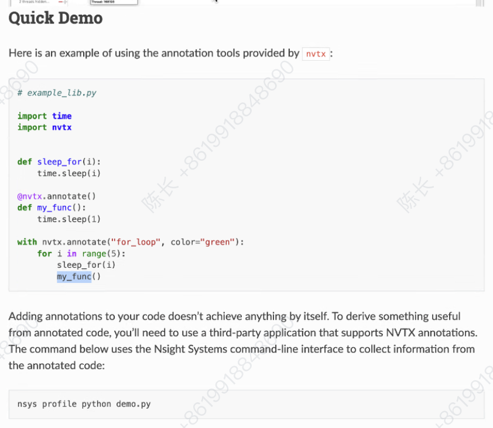

# EgoVLA and Our Better Solution

## Environment Setup

如果需要多机训练，确保你的多台服务器满足以下要求：

- 有共享盘，你所有的代码、数据、环境最好全部放在这个共享盘当中，并且通过软链接到同一个位置。
- 请确保你在不同服务器上的 UID 和 GID 一致，不然可能会导致权限问题。
- 配置多机之间通信，DeepSpeed 要求训练的多机之间要能 ssh 免密通信，因此需要配置好每台机器之间的 ssh 连接（包括本机与本机）。

在需要多机并行的每台机器上，下载仓库并安装 conda 环境，放置到一个共享文件夹：

```bash
git clone https://github.com/Psi-Robot/EgoVLA
cd EgoVLA
./scripts/install.sh
```

前往 MANO [官网](https://mano.is.tue.mpg.de/)，下载模型 `mano_v*_*.zip`，解压后按照如下方式放置：

```bash
manopth/
  mano/
    models/
      MANO_LEFT.pkl
      MANO_RIGHT.pkl
      ...
  manopth/
    __init__.py
    ...
```

配置 wandb，使用国内的镜像站（可选）：

```bash
export WANDB_BASE_URL=https://api.bandw.top
```

wandb 登陆：

```bash
wandb login
```

## Data Processing

### For each dataset

每个数据集名字命名的文件夹中有两个代码：

- mano_trans：将 raw hand pose / 45 + 3d 的 MANO 参数和腕部平移信息一起，转化为 3D 腕部平移，rot6D 腕部旋转和前 15D mano PCA 分量。最好将 mano 信息存放到数据集根目录下的子文件夹中，方便 build_zarr。使用方式：

```bash
python mano_trans.py --data_root PATH/TO/DATASET --output_root PATH/TO/OUTPUT_DIR
```

- build_zarr：读取视频信息、相机外参、语言标注以及转换好的手部、腕部数据，将这些信息封装在一个 zarr 目录中。代码使用方式：

```bash
python build_zarr.py --data_root PATH/TO/DATASET --output PATH/TO/OUTPUT_ZARR_DIR
```

经过封装后，会生成如下格式的 zarr 目录：

```
├── data
│   ├── action       下一帧本体感知
│   │   ├── hand     (sum_frames, 30) float32 先左后右
│   │   └── wrist    (sum_frames, 18) float32 左平移，右平移，左旋转，右旋转
│   ├── extrinsic    (sum_frames, 16) float32
│   ├── image        (sum_frames, 384, 384, 3) uint8 注意图像都被插值成 384x384
│   ├── instruction  (sum_frames,) strin
│   └── state        当前帧本体感知
│       ├── hand     (sum_frames, 30) float32 同 action
│       └── wrist    (sum_frames, 18) float32 同 action
└── meta
    ├── episode_ends (num_episodes,) int64 同 dexgrasp
    └── presence     (num_episodes,) int8  左右手可见情况，1 左 2 右 3 均可见
```

### Dataset visualizer

`data/visualizer.py` 可以对生成好的 zarr 格式的数据集进行可视化。该 visualizer 会将数据集某一帧的语言指令、被插值后的图片以及两只手的 pose 可视化出来。

注意需要用 `--mano_root`, `--manopth_path` 两个参数传递 mano 模型和 manopth 库的路径。

默认会从所有帧中随机一帧进行可视化，也可以用 `--index n` 参数来指定可视化第 n 帧。

有两种模式：不打开 `--camera_view` 参数时，会将插值后的图片显示在图像的左半边，并将两只手的 mesh 显示在图像的右半边，注意 mesh 可视化的视角不是相机视角；打开该参数时，会将手部 mesh 的顶点以及 21 个关节位置重叠在左半边的图像上。注意如果不传递内参信息，则手部位置可视化结果可能不太准确。

外参信息可以存在 .npy 文件中（支持 4×4, 3×3 或直接以 `fx, fy, cx, cy` 形式给出），并调用 `--intrinsic_path PATH/TO/INTR_NPY`；也可以手动调用 `--fx --fy --cx --cy` 四个参数给出。

使用示例：
```bash
python data/visualizer.py --mano_root PATH/TO/MANO_MODEL --manopth_path PATH/TO/MANOPTH_LIB \
  --zarr PATH/TO/DATASET \
  --index N \
  --intrinsic_path PATH/TO/INTR_NPY \
  --camera_view
```

## Training

### Single Node

配置 Accelerate 默认 config：

```bash
Accelerate config
```

```bash
./scripts/pretrain.sh
```

### Multi Node with DeepSpeed

在训练之前，请你根据 comments 修改 `egovla/config/acc_node0.yaml` 下有关多机信息的内容。

```bash
./scripts/pretrain_deepspeed.sh
```

如果希望从 checkpoint 中恢复训练，有以下两种选择：

1. 保证训练环境和恢复的 checkpoint 原本的训练环境一致（GPU 数量和分布一致），然后在 `src/config/ds_config` 当中设置如下字段：

```
"checkpoint": {
    "load_universal": false
}, 
```

接着，在 `src/config/xxxx.yaml` 当中修改 `training/resume_checkpoint_path` 字段为你指定的 checkpoint。

2. 如果训练环境和恢复的 checkpoint（使用 Deepspeed ZeRO 训练）原本的训练环境不一致，需要在使用 Deepspeed 提供的 universal checkpoint。

首先在 `src/config/ds_config` 当中设置如下字段：

```
"checkpoint": {
    "load_universal": true
}, 
```

接着，使用 Deepspeed 提供的 `ds_to_universal.py` 将 ZeRO 训练保存的 checkpoint 转换为 universal checkpoint：

```
python ds_to_universal.py \
  --input_folder your_input_folder \
  --output_folder your_output_folder \
  --inject_missing_state
```

接着，在 `src/config/xxxx.yaml` 当中修改 `training/resume_checkpoint_path` 字段为你指定的转换后的 checkpoint。

请注意，本项目通过 Accelerate 实现，因此在保存 checkpoint 时，除了 Deepspeed 保存的 `pytorch_model` 文件夹以外，还保存了一些其他的信息。
在上面的转换中，你需要把 `pytorch_model` 文件夹作为输入，直接替换同样的位置作为输出。
然后 config file 当中填的 path 为 `pytorch_model` 文件夹的父文件夹（Accelerate 保存的文件夹）。

## Inference


## Visualization

`visualize.py`提供模型预测结果的可视化，能够将30帧手部运动预测序列渲染为两个视频：2D投影视频（将3D手部姿态投影到背景图像上）和3D可视化视频（在3D空间中显示手部mesh和骨架结构）。

### 使用方法

基本使用：
```bash
python visualize.py --data_path /path/to/predictions.pt --mano_root_dir /path/to/manopth --show_mesh --show_gt
```

完整参数示例：
```bash
python visualize.py \
  --data_path /path/to/predictions.pt \
  --mano_root_dir /path/to/manopth \
  --sample_id 0 \
  --find_worst \
  --target_width 1920 \
  --target_height 1080 \
  --video_name hand_motion.mp4 \
  --video_3d_name hand_motion_3d.mp4 \
  --output_dir ./output \
  --fps 30 \
  --show_mesh \
  --mesh_alpha 0.9 \
  --show_gt
```

### 参数说明

#### 必选参数
- `--data_path`: 包含预测结果、相机参数和背景图像的完整数据文件路径
- `--mano_root_dir`: manopth仓库的根目录路径

#### 可选参数

##### 样本选择参数：
- `--sample_id`: 要可视化的样本索引 (默认: 0)
- `--find_worst`: 自动寻找并使用所有sample中loss最大的样本

##### 输出设置参数：
- `--output_dir`: 输出目录 (默认: `./output`)
- `--video_name`: 2D投影视频输出文件名 (默认: `hand_motion.mp4`)
- `--video_3d_name`: 3D mesh+骨架视频输出文件名 (默认: `hand_motion_3d.mp4`)
- `--target_width`: 目标视频宽度像素 (默认: 1920)
- `--target_height`: 目标视频高度像素 (默认: 1080)
- `--fps`: 视频帧率 (默认: 30)


##### 可视化效果参数：
- `--show_mesh`: 在2D投影视频中显示手部3D mesh重建结果（3D视频中总是显示mesh）
- `--mesh_alpha`: 2D投影视频中网格的透明度，范围0.0-1.0 (默认: 0.9)
- `--show_gt`: 在2D投影视频中显示ground truth标注（绿色）与预测结果对比

### 输出格式

该工具会生成两个视频文件：

1. **2D投影视频** (`hand_motion.mp4`):
   - 静态背景图像（来自数据集，缩放到指定分辨率）
   - 30帧手部运动预测序列投影到2D图像上
   - 手部骨架连线和3D mesh重建结果（如果启用`--show_mesh`）
   - 可选的真值对比（如果启用`--show_gt`，以绿色显示）

2. **3D mesh+骨架视频** (`hand_motion_3d.mp4`):
   - 3D坐标空间中的手部mesh和骨架可视化
   - 固定尺寸800x600的3D渲染视图

## Debug


### Nsight

Nsight 是 Nvidia 用于监控 GPU 使用情况的一个库，他能准确的告诉你，每个时刻 GPU 是在调用内核还是内存访问，还是与 cpu 或者其他 gpu 的通信。

有两种启动方法：1. `nsys launch` 2. `nsys profile`

从 Nvidia Nsight [官网](https://developer.nvidia.com/nsight-systems/get-started)，在服务器上下载：Nsight CLI，并使用 `dpkg -i Nsight...` 安装。

在本地机器上下载：Nisight Host，用于可视化记录的结果。

1. 对于一个单机程序，只需要在启动命令（如 `python/accelerate launch`）前先加上 `nsys launch`。然后在训练稳定后，使用 `nsys start -o profile_result_file_name`，即可启动，并且将结果保存在 `profile_result_file_name` 中。使用 `nsys stop` 停止记录，会自动生成上述文件，但程序依然在进行。（**如上方法暂时不知道如何拓展到多机，比如与 deepspeed 配合使用**）
2. 对于多机程序，在训练之前，将如下内容写入 shell 脚本（和设置通信环境变量的一起）：`nsys profile -t cuda,mpi,nvtx,cudnn -o rname.%p python xxx.py [args] `。然后再启动 accelerate/deepspeed：`accelerate launch --config_file egovla/config/acc_node0.yaml --no_python ./scripts/pretrain_deepspeed_nsys.sh`。如上采用 nsight profile 记录，只会返回 **每张卡独自的内容**。

**使用 NVTX 标记代码段：**我们希望追踪 Nsight 中记录的 GPU 运行来源于哪一段代码，只需按照如下方式用 NVTX 对代码进行修饰，最后就可以在 nsight 的 NVTX 段看到对应的标记：




### VSCode Debugger

这部分讲解 DeepSpeed 分布式训练（多机或单机多卡）中使用 VS Code 进行断点调试的方案。


**注意：如要使用这种调试方案，不要在软链接（Symlink）路径下打开 VS Code！**
*   **现象**：调试器能连接，但断点变灰（Unverified Breakpoint），程序不暂停。
*   **原因**：Python 运行的是文件的真实物理路径，而 VS Code 打开的是软链路径，两者路径不匹配导致断点失效。
*   **解决**：请直接打开项目的**真实物理路径** (Real Path) 进行开发和调试。

#### 1. 安装依赖
在训练环境中安装 `debugpy`：
```bash
pip install debugpy
```

#### 2. 修改入口代码 (如 `train.py`)
在代码最开头（`import deepspeed` 之后）注入调试钩子，确保只在 **Rank 0** 挂起：

```python
import os
import deepspeed

# 1. 获取本地 Rank，避免所有卡都监听端口
local_rank = int(os.environ.get("LOCAL_RANK", -1))

if local_rank == 0:
    import debugpy
    # 2. 监听端口，等待 VS Code 连接
    # 0.0.0.0 允许从外部/容器外连接，5678 是常用端口
    debugpy.listen(("0.0.0.0", 5678))
    
    print(f"👻 Rank {local_rank}: 等待 VS Code 调试器连接 (端口 5678)...")
    print(f"👉 请确保 VS Code 打开的是真实路径 (非软链接)！")
    
    # 3. 程序在此暂停，直到调试器挂载
    debugpy.wait_for_client()
    print(f"✅ 调试器已连接，开始训练...")

# ... 后续训练代码 ...
```

#### 3. 配置 VS Code (`launch.json`)
在 `.vscode/launch.json` 中添加 **Remote Attach** 配置：

```json
{
    "version": "0.2.0",
    "configurations": [
        {
            "name": "Attach to DeepSpeed (Rank 0)",
            "type": "python",
            "request": "attach",
            "connect": {
                "host": "localhost",
                "port": 5678
            },
            "pathMappings": [
                {
                    "localRoot": "${workspaceFolder}",
                    "remoteRoot": "${workspaceFolder}"
                }
            ],
            "justMyCode": true
        }
    ]
}
```

#### 4. 启动命令 (设置超时)
启动训练时，务必设置 **NCCL 超时时间**，否则 Rank 0 暂停调试时，其他 GPU 会因超时报错退出。

在启动脚本（比如`pretrain_legendvla_deepspeed.sh`）中添加这两个环境变量：
```bash
# 设置 NCCL 超时为 1 小时 (单位毫秒: 3600000)
export NCCL_TIMEOUT=3600000 
export NCCL_ASYNC_ERROR_HANDLING=1
```

#### 5. 调试流程
1.  终端运行启动脚本，看到 `等待 VS Code 调试器连接...` 日志。
2.  在 VS Code 中打好断点（**确保是真实路径下的文件**）。
3.  按 **F5** 启动 "Attach to DeepSpeed (Rank 0)"。
4.  程序将恢复运行并在断点处暂停。

## Project Structure

