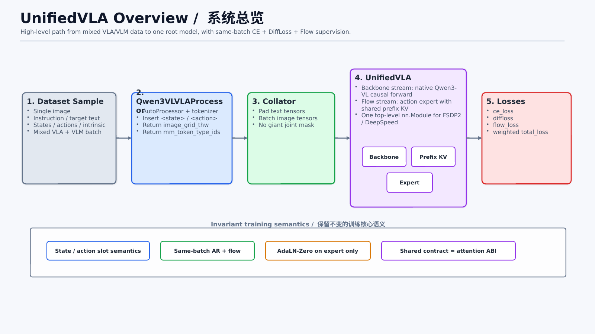
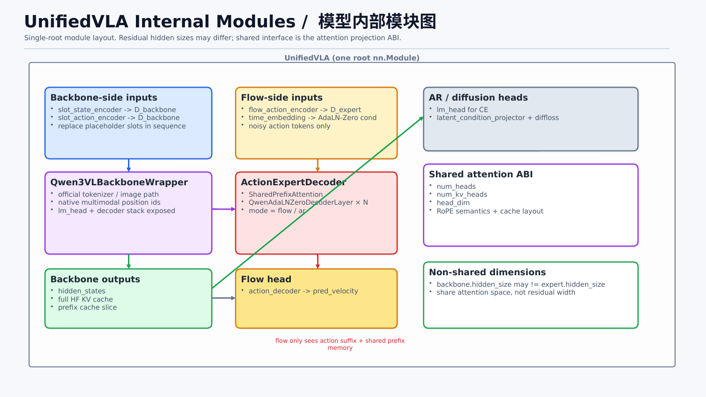
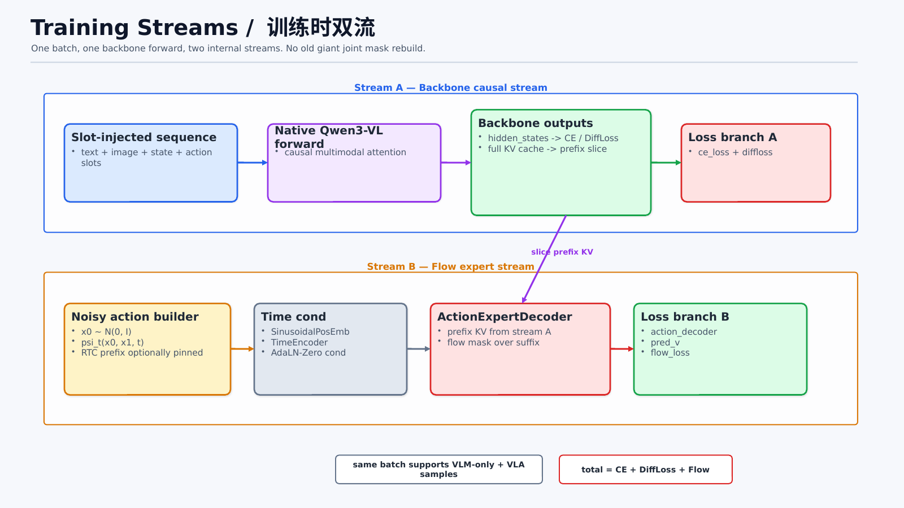
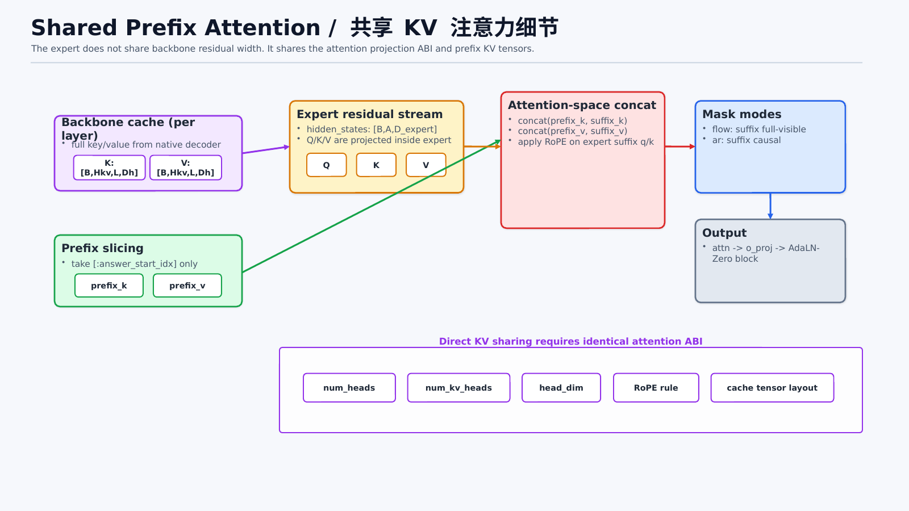
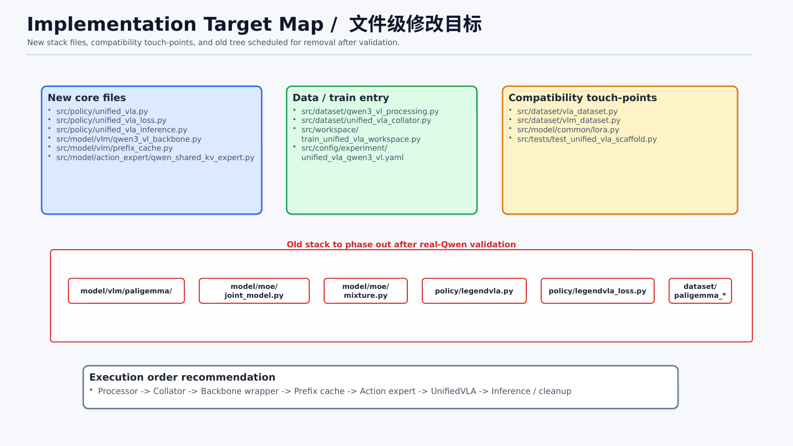

# LegendVLA with Qwen3-VL

## Overview

This document defines the implementation plan for the next-generation `LegendVLA` model in this repository.

The target design replaces the current handwritten PaliGemma-centered stack with a new single-root model built around a Hugging Face multimodal backbone, while preserving the current training core:

- Keep `state` and `action` token-slot injection semantics unchanged.
- Keep same-batch joint optimization of `AR + flow` losses.
- Keep `AdaLN-Zero` time conditioning for the flow expert.
- Keep all trainable parameters under one top-level `nn.Module` for FSDP2 / DeepSpeed compatibility.
- Support future backbone switching with minimal changes, while preserving per-layer shared attention through prefix KV sharing.

The first implementation target is `Qwen3-VL` with the following simplifications:

- Single image only.
- No multi-frame memory.
- No depth input.
- No `pi0.5` checkpoint loading compatibility.

## Naming Note

- The active Qwen3-VL model class keeps the original name `LegendVLA`.
- `Qwen3VLVLAProcessor` and `UnifiedVLACollator` keep their current names to minimize migration churn.
- The active model implementation now lives in `src/policy/legendvla.py`.

## Design Principles

### Stable contracts

The new design explicitly distinguishes three spaces:

1. **Residual space**: hidden states inside the backbone / expert residual stream.
2. **Attention space**: projected `Q / K / V` space defined by `num_heads`, `num_kv_heads`, and `head_dim`.
3. **Token-slot space**: the sequence layout that contains text slots, image slots, state slots, and action slots.

The shared contract between backbone and action expert is **attention ABI**, not residual hidden size.

This means:

- `backbone.hidden_size` and `expert.hidden_size` may differ.
- `expert` and `backbone` must agree on:
  - `num_heads`
  - `num_kv_heads`
  - `head_dim`
  - `rope` semantics
  - KV cache tensor layout

### Two-stream training inside one model

The model runs two internal streams in the same forward pass:

- **Backbone stream**
  - Native multimodal causal forward.
  - Produces hidden states for `CE + AR/diffloss`.
  - Produces prefix KV memory for the flow expert.

- **Flow expert stream**
  - Uses prefix KV from the backbone.
  - Uses noisy action embeddings plus `AdaLN-Zero` time conditioning.
  - Produces flow velocity predictions.

This keeps the model simple without rebuilding the current giant joint block mask.

### Native image semantics

Image token semantics should follow the selected backbone implementation.

For the first version:

- `Qwen3-VL` image handling, position IDs, and multimodal causal behavior are used as-is.
- We do not force PaliGemma-style bidirectional image prefix behavior onto the backbone.

## Visual Architecture

The Mermaid overview has been replaced by a static diagram pack under `docs/architecture/`.

These diagrams are intended for implementation work, code review, and design discussion. They are easier to read than the previous single Mermaid graph and do not depend on Markdown preview Mermaid support.

### Diagram pack

- Quick overview montage: `docs/architecture/unified_vla_montage.png`
- Detailed architecture PNGs: `docs/architecture/unified_vla_*.png`
- Rendered slide exports: `docs/architecture/rendered/slide-1.png` to `docs/architecture/rendered/slide-5.png`

### Diagram 1 — System overview

Shows the end-to-end path from mixed VLA/VLM samples to one root `LegendVLA` module and the final weighted losses.



### Diagram 2 — Internal module layout

Shows the internal block structure of `LegendVLA`, including the backbone-side slot encoders, the expert-side flow modules, and the shared-attention ABI boundary.



### Diagram 3 — Two-stream training flow

Shows how one batch is processed by:

- one native backbone causal stream
- one flow expert stream
- one shared prefix-KV boundary

while still supporting same-batch `CE + DiffLoss + Flow`.



### Diagram 4 — Shared prefix attention detail

Shows the most important low-level design point in this migration:

- the backbone and the expert do **not** need to share residual hidden size
- they **do** need to share the attention ABI and cache layout
- prefix KV is shared in attention space, not by residual-state identity



### Diagram 5 — File-level implementation target map

Shows the new files, compatibility touch-points, and the old stack scheduled for removal after the new path is validated.



## Repository Layout

The following files will be introduced as the new main implementation tree.

### New files

- `src/policy/legendvla.py`
- `src/policy/legendvla_loss.py`
- `src/policy/legendvla_inference.py`
- `src/model/vlm/qwen3_vl_backbone.py`
- `src/model/vlm/prefix_cache.py`
- `src/model/action_expert/qwen_shared_kv_expert.py`
- `src/dataset/qwen3_vl_processing.py`
- `src/dataset/unified_vla_collator.py`
- `src/workspace/train_unified_vla_workspace.py`
- `src/config/experiment/legendvla_qwen3_vl.yaml`

### Compatibility touch-points

These files are not part of the new core tree, but they still need coordinated changes during migration:

- `src/dataset/vla_dataset.py`
- `src/dataset/vlm_dataset.py`
- `src/model/common/lora.py`
- `src/tests/test_unified_vla_scaffold.py`
- `docs/architecture/unified_vla_montage.png`
- `docs/architecture/unified_vla_overview.png`
- `docs/architecture/unified_vla_model_blocks.png`
- `docs/architecture/unified_vla_training_streams.png`
- `docs/architecture/unified_vla_shared_kv.png`
- `docs/architecture/unified_vla_file_map.png`

### Old files to phase out

These files should no longer be referenced by config after the new stack is live:

- `src/model/vlm/paligemma/`
- `src/model/moe/joint_model.py`
- `src/model/moe/mixture.py`
- Removed migration leftovers: `src/policy/unified_vla.py`, `src/policy/unified_vla_loss.py`, `src/policy/unified_vla_inference.py`, `src/policy/legendvla_utils.py`, `src/dataset/paligemma_processing.py`

These files are migration leftovers from the old stack and can be removed once the Qwen3-VL LegendVLA path is the only supported path.

## File-by-File Implementation Blueprint

### `src/model/vlm/prefix_cache.py`

Purpose:

- Define a normalized representation of prefix KV memory extracted from the HF backbone.
- Hide direct dependence on Hugging Face cache internals from the rest of the code.

#### Data classes

```python
from dataclasses import dataclass
import torch


@dataclass
class LayerKV:
    key: torch.Tensor
    value: torch.Tensor


@dataclass
class PrefixKVCache:
    layers: list[LayerKV]
    mask: torch.Tensor
    lengths: torch.Tensor


@dataclass
class BackboneStreamOutput:
    last_hidden_states: torch.Tensor
    all_hidden_states: tuple[torch.Tensor, ...] | None
    position_ids: torch.Tensor
    past_key_values_hf: object
    prefix_cache: PrefixKVCache | None
```

#### Tensor shapes

- `LayerKV.key`: `[B, H_kv, Lp_max, Dh]`
- `LayerKV.value`: `[B, H_kv, Lp_max, Dh]`
- `PrefixKVCache.mask`: `[B, Lp_max]`
- `PrefixKVCache.lengths`: `[B]`
- `BackboneStreamOutput.last_hidden_states`: `[B, L, D_backbone]`
- `BackboneStreamOutput.position_ids`: for Qwen3-VL use `[3, B, L]`

#### Functions

- `slice_prefix_cache_from_full_kv(full_kv, prefix_lengths) -> PrefixKVCache`
- `build_prefix_mask(prefix_lengths, max_prefix_len) -> BoolTensor[B, Lp_max]`
- `gather_action_position_ids(input_ids, action_token_id, position_ids, n_actions) -> LongTensor`

#### Notes

- Prefix length is derived from `answer_start_idx`.
- Prefix means everything before the action answer region.
- The implementation should be explicit about whether HF cache stores repeated KV or grouped KV; the expert must consume the same format.

### `src/model/vlm/qwen3_vl_backbone.py`

Purpose:

- Wrap `Qwen3VLForConditionalGeneration` into a thin custom backbone module that supports current slot injection semantics.

#### Main class

```python
class Qwen3VLBackboneWrapper(nn.Module):
    def __init__(self, cfg):
        ...

    def resize_token_embeddings(self, vocab_size: int) -> None:
        ...

    def build_base_text_embeds(self, input_ids: torch.LongTensor) -> torch.Tensor:
        ...

    def build_inputs_embeds(
        self,
        input_ids: torch.LongTensor,
        pixel_values: torch.Tensor,
        image_grid_thw: torch.Tensor,
        mm_token_type_ids: torch.Tensor,
        state_slot_embeds: torch.Tensor | None,
        action_slot_embeds: torch.Tensor | None,
        state_token_id: int,
        action_token_id: int,
    ) -> torch.Tensor:
        ...

    def compute_position_ids(
        self,
        input_ids: torch.LongTensor,
        inputs_embeds: torch.Tensor,
        attention_mask: torch.Tensor,
        image_grid_thw: torch.Tensor,
        mm_token_type_ids: torch.Tensor,
        past_key_values=None,
    ) -> torch.Tensor:
        ...

    def forward_language_model(
        self,
        inputs_embeds: torch.Tensor,
        attention_mask: torch.Tensor,
        position_ids: torch.Tensor,
        use_cache: bool,
        output_hidden_states: bool,
    ) -> BackboneStreamOutput:
        ...
```

#### Responsibilities

- Load the official HF model.
- Build text embedding using the official embedding layer.
- Encode images using the official visual path.
- Replace image / state / action placeholders in the sequence embedding tensor.
- Compute native Qwen3-VL multimodal position IDs.
- Run native language-model forward with cache enabled.

#### Important implementation details

- `input_ids` and `inputs_embeds` are mutually exclusive in official HF entry points, but this wrapper must still support image replacement and custom state/action slot injection.
- Therefore the wrapper must call official lower-level modules rather than relying only on top-level `forward`.
- Image placeholder behavior must follow Qwen3-VL implementation.
- The wrapper must expose the HF `lm_head` and text decoder stack to the policy.

#### Tensor shapes

- `inputs_embeds`: `[B, L, D_backbone]`
- `position_ids`: `[3, B, L]`
- `attention_mask`: `[B, L]`

### `src/model/action_expert/qwen_shared_kv_expert.py`

Purpose:

- Implement the action expert that shares prefix KV with the backbone while using its own residual hidden size and `AdaLN-Zero` conditioning.

#### Key classes

```python
class SharedPrefixAttention(nn.Module):
    def __init__(self, cfg):
        ...

    def forward(
        self,
        hidden_states: torch.Tensor,
        prefix_k: torch.Tensor,
        prefix_v: torch.Tensor,
        prefix_mask: torch.Tensor,
        action_mask: torch.Tensor,
        action_position_ids: torch.Tensor,
        mode: str,
    ) -> torch.Tensor:
        ...


class QwenAdaLNZeroDecoderLayer(nn.Module):
    def __init__(self, cfg):
        ...

    def forward(
        self,
        hidden_states: torch.Tensor,
        prefix_k: torch.Tensor,
        prefix_v: torch.Tensor,
        prefix_mask: torch.Tensor,
        action_mask: torch.Tensor,
        action_position_ids: torch.Tensor,
        time_cond: torch.Tensor,
        mode: str,
    ) -> torch.Tensor:
        ...


class ActionExpertDecoder(nn.Module):
    def __init__(self, cfg):
        ...

    def forward(
        self,
        action_embeds: torch.Tensor,
        prefix_cache: PrefixKVCache,
        action_position_ids: torch.Tensor,
        time_cond: torch.Tensor,
        action_mask: torch.Tensor,
        mode: str,
    ) -> torch.Tensor:
        ...
```

#### Core constraints

- `expert.hidden_size` may differ from `backbone.hidden_size`.
- `expert` must still match the backbone attention ABI:
  - `num_heads`
  - `num_kv_heads`
  - `head_dim`
  - RoPE rule
- First version uses `kv_share_mode=direct`.
- `AdaLN-Zero` is applied only inside the expert path.

#### Tensor shapes

- `hidden_states`: `[B, A, D_expert]`
- `prefix_k`: `[B, H_kv, Lp, Dh]`
- `prefix_v`: `[B, H_kv, Lp, Dh]`
- `action_position_ids`: `[3, B, A]` or `[B, A]` depending on chosen RoPE implementation wrapper
- `time_cond`: `[B, D_time]` or `[B, A, D_time]`

#### Masking rules

- Prefix is always visible to suffix action tokens.
- `mode="flow"`: suffix tokens attend to all suffix tokens.
- `mode="ar"`: suffix tokens attend causally within suffix.

### `src/dataset/qwen3_vl_processing.py`

Purpose:

- Replace current PaliGemma processor with a Qwen3-VL-based processor while preserving current training semantics.

#### Main class

```python
class Qwen3VLVLAProcessor:
    STATE_TOKEN = "<state>"
    ACTION_TOKEN = "<action>"

    def __init__(self, cfg):
        ...

    def __call__(
        self,
        text: str,
        image,
        states,
        actions,
        intrinsic,
        objective: str | None,
        mode: str,
        target_text: str | None = None,
    ) -> dict:
        ...
```

#### Responsibilities

- Use official `AutoProcessor` for Qwen3-VL image and tokenizer handling.
- Add `<state>` and `<action>` tokens to the tokenizer.
- Build prompt text with the same semantics as current implementation.
- Compute:
  - `input_ids`
  - `attention_mask`
  - `labels`
  - `pixel_values`
  - `image_grid_thw`
  - `mm_token_type_ids`
  - `answer_start_idx`
  - `n_states`
  - `n_actions`

#### Prompt structure

The first version should preserve the current prompt semantics as closely as possible:

```text
Task: {instruction}, Camera intrinsic: {intrinsic_str}, States: <state><state>... Actions: <action><action>...
```

#### Tensor conventions

- `input_ids`: `[L]`
- `attention_mask`: `[L]`
- `labels`: `[L]`
- `pixel_values`: follow official Qwen3-VL processor output format
- `image_grid_thw`: shape defined by official processor

### `src/dataset/unified_vla_collator.py`

Purpose:

- Pad all batch-level tensors for the new pipeline.

#### Main class

```python
class UnifiedVLACollator:
    def __init__(self, pad_token_id: int, ignore_index: int):
        ...

    def __call__(self, features: list[dict]) -> dict:
        ...
```

#### Responsibilities

- Pad `input_ids`, `attention_mask`, `labels`.
- Batch `pixel_values`, `image_grid_thw`, `mm_token_type_ids`.
- Batch `states`, `actions`, `answer_start_idx`, `n_states`, `n_actions`.
- Do **not** build the old giant joint causal mask.

### `src/policy/legendvla.py`

Purpose:

- Define the new single-root policy module.

#### Main class

```python
class LegendVLA(nn.Module):
    def __init__(self, cfg, shape_meta):
        ...

    def build_slot_embeddings(self, batch: dict) -> dict:
        ...

    def forward_backbone_stream(self, batch: dict, slot_embeds: dict) -> BackboneStreamOutput:
        ...

    def forward_flow_stream(
        self,
        batch: dict,
        backbone_output: BackboneStreamOutput,
        slot_embeds: dict,
    ) -> dict:
        ...

    def compute_loss(self, batch: dict) -> dict:
        ...

    def forward(self, mode: str, batch: dict, **kwargs) -> dict:
        ...
```

#### Submodules

- `backbone`
- `slot_state_encoder`
- `slot_action_encoder`
- `flow_action_encoder`
- `time_embedding`
- `flow_expert`
- `latent_condition_projector`
- `diffloss`
- optional `lm_head`

#### Responsibilities

- Build slot embeddings for state/action replacement.
- Run one backbone causal stream.
- Reuse backbone hidden states for CE and AR/diffloss.
- Slice prefix KV for flow expert.
- Run flow expert with noisy actions.

#### Recommended source reuse

- Slot replace semantics from current `src/policy/legendvla.py:486`
- Time embedding from `src/model/common/modules.py:102`
- `AdaLNZero` from `src/model/common/modules.py:212`
- Fourier encoder from `src/model/action/action_head.py:37`

### `src/policy/legendvla_loss.py`

Purpose:

- Organize same-batch `CE + AR/diffloss + flow` losses.

#### Main functions

```python
def compute_total_loss(model, batch: dict) -> dict:
    ...

def compute_ce_loss(...):
    ...

def compute_diffloss_loss(...):
    ...

def compute_flow_loss(...):
    ...
```

#### Forward order

1. Build slot embeddings.
2. Run backbone stream once.
3. Compute `ce_loss` from backbone hidden states.
4. Compute `ar_loss / diffloss` from backbone hidden states and action positions.
5. Slice prefix KV from backbone cache.
6. Build noisy flow actions and `time_cond`.
7. Run flow expert stream.
8. Compute `flow_loss`.
9. Sum weighted losses.

#### Why this order

- Same batch supports both AR and flow.
- No giant unified causal mask is required.
- Backbone stream remains faithful to backbone-native multimodal causal logic.
- Flow stream remains faithful to expert-specific suffix logic.

### `src/policy/legendvla_inference.py`

Purpose:

- Implement inference using the same model modules.

#### Main functions

- `prepare_prefix_memory(model, batch)`
- `infer_flow_action(model, batch, prev_action_chunk=None, inference_delay=0)`
- `infer_ar_action(model, batch, max_new_tokens=...)`

#### Inference logic

- Flow inference:
  - Run prefix memory once.
  - Reuse prefix KV across denoising steps.
- AR inference:
  - Reuse the backbone causal path.
  - May later share expert path if desired, but first version can stay close to current AR behavior.

### `src/workspace/train_unified_vla_workspace.py`

Purpose:

- Provide a custom training loop entry point without relying on HF Trainer.

#### Responsibilities

- Instantiate dataset / processor / collator / model.
- Configure optimizer parameter groups.
- Support FSDP2 / DeepSpeed wrapping of one root model.
- Run training, validation, logging, checkpointing.

### `src/config/experiment/legendvla_qwen3_vl.yaml`

Purpose:

- Hold first-version config for the new stack.

#### Required fields

```yaml
model:
  backbone:
    model_name_or_path: Qwen/Qwen3-VL-4B-Instruct
    freeze_backbone: true
    use_lora: false
  slot_tokens:
    state_token: <state>
    action_token: <action>
  shared_attention:
    num_heads: ...
    num_kv_heads: ...
    head_dim: ...
    rope_theta: ...
  expert:
    hidden_size: ...
    intermediate_size: ...
    num_layers: ...
    adaln_zero: true
  kv_share_mode: direct
  use_depth: false
  single_image_only: true
loss_weights:
  ce: ...
  diffusion: ...
  flow: ...
```

#### Assertions for first version

When `kv_share_mode=direct`, add explicit checks:

- `expert.num_kv_heads == backbone.num_kv_heads`
- `expert.head_dim == backbone.head_dim`
- First version should also set `expert.num_heads == backbone.num_heads`

## Shape Tables

### Backbone stream

| Tensor | Shape | Notes |
| --- | --- | --- |
| `input_ids` | `[B, L]` | Contains text + image/state/action placeholders |
| `attention_mask` | `[B, L]` | Native causal mask input for backbone |
| `pixel_values` | official Qwen3-VL format | Single image only in first version |
| `image_grid_thw` | official Qwen3-VL format | Produced by processor |
| `mm_token_type_ids` | `[B, L]` | Required by Qwen3-VL multimodal positions |
| `slot_state_embeds` | `[B, S, D_backbone]` | Used only to replace state slots |
| `slot_action_embeds` | `[B, A, D_backbone]` | Used for AR backbone stream |
| `inputs_embeds` | `[B, L, D_backbone]` | Final slot-replaced backbone embeddings |
| `position_ids` | `[3, B, L]` | Qwen3-VL multimodal position IDs |
| `hidden_states` | `[B, L, D_backbone]` | Used for CE + AR/diffloss |

### Prefix cache

| Tensor | Shape | Notes |
| --- | --- | --- |
| `prefix_lengths` | `[B]` | Usually derived from `answer_start_idx` |
| `prefix_mask` | `[B, Lp_max]` | Boolean valid-prefix mask |
| `prefix_k` | `[B, H_kv, Lp_max, Dh]` | One per layer |
| `prefix_v` | `[B, H_kv, Lp_max, Dh]` | One per layer |

### Flow expert stream

| Tensor | Shape | Notes |
| --- | --- | --- |
| `flow_actions_noisy` | `[B, A, D_action]` | Flow-matching noisy action targets |
| `flow_action_embeds` | `[B, A, D_expert]` | Output of flow action encoder |
| `time_cond` | `[B, D_time]` or `[B, A, D_time]` | Used by AdaLN-Zero |
| `action_position_ids` | `[3, B, A]` or `[B, A]` | Depends on expert rope helper |
| `flow_hidden` | `[B, A, D_expert]` | Output of action expert decoder |
| `pred_velocity` | `[B, A, D_action]` | Output of flow head |

## Same-Batch AR + Flow Training Logic

### Current requirement

The repository must preserve the ability to compute AR-oriented supervision and flow-matching supervision in the same batch, matching the current training semantics.

### New implementation strategy

Do **not** rebuild the old unified giant causal mask.

Instead:

1. Run one native backbone causal forward over the full slot-injected sequence.
2. Use backbone outputs for:
   - `ce_loss`
   - `ar_loss / diffloss`
3. Slice prefix KV from the same forward result.
4. Run a separate flow expert stream over action suffix tokens only.
5. Compute `flow_loss`.

This satisfies the original requirement while reducing coupling.

### Why it is valid

- Prefix KV at prefix positions is unaffected by future suffix tokens under causal decoding.
- Therefore the prefix cache extracted from the full causal run is valid for the flow expert.
- AR and flow can therefore share the same slot-injected batch and still remain internally clean.

## Migration Stages

### Stage 0: Documentation and scaffolding

- Add this plan document.
- Add new config file skeleton.
- Add empty file skeletons with class signatures.

### Stage 1: Processor and collator

- Implement `Qwen3VLVLAProcessor`.
- Implement `UnifiedVLACollator`.
- Validate:
  - slot token insertion
  - label generation
  - `answer_start_idx`
  - `n_states`, `n_actions`

### Stage 2: Backbone wrapper

- Implement `Qwen3VLBackboneWrapper`.
- Port current slot replacement logic.
- Validate:
  - image slot replacement
  - state slot replacement
  - action slot replacement
  - native Qwen3-VL position ID generation

### Stage 3: Prefix cache utilities

- Implement `PrefixKVCache` normalization helpers.
- Validate slicing prefix from full causal run.

### Stage 4: Flow expert

- Implement `SharedPrefixAttention`.
- Implement `QwenAdaLNZeroDecoderLayer`.
- Implement `ActionExpertDecoder`.
- Validate:
  - shape correctness
  - direct KV sharing compatibility
  - `flow` and `ar` mask behavior

### Stage 5: Unified policy and loss

- Implement `LegendVLA`.
- Implement `legendvla_loss.py`.
- Validate same-batch `CE + AR/diffloss + flow`.

### Stage 6: Inference and workspace

- Implement flow inference.
- Implement AR inference.
- Add training workspace.
- Run smoke tests.

### Stage 7: Cleanup

- Switch config entry points to the new model.
- Remove references to the legacy PaliGemma LegendVLA stack.
- Delete obsolete files after validation.

## Risks and Mitigations

### Risk: Qwen3-VL wrapper complexity

Reason:

- Official top-level forward assumes either `input_ids` or `inputs_embeds`.
- We need image replacement plus custom state/action slot replacement.

Mitigation:

- Use a thin wrapper around lower-level official modules.
- Keep wrapper logic focused only on embedding assembly and language-model forwarding.

### Risk: HF cache layout mismatch

Reason:

- Cache structure may vary across versions.

Mitigation:

- Normalize cache immediately into `PrefixKVCache`.
- Keep the rest of the code independent from raw HF cache objects.

### Risk: Expert RoPE mismatch

Reason:

- Prefix KV and expert suffix queries must use compatible positional semantics.

Mitigation:

- First version aligns shared attention ABI with backbone.
- Add explicit config assertions.

### Risk: Same-batch AR + flow coupling bugs

Reason:

- Both objectives depend on the same slot-injected sequence.

Mitigation:

- Keep one backbone forward.
- Use a separately defined flow expert stream.
- Add focused smoke tests.

## Validation Checklist

### Unit-level checks

- Processor inserts `<state>` and `<action>` correctly.
- Slot replacement matches current semantics.
- Prefix cache slicing returns the expected prefix length.
- SharedPrefixAttention respects `flow` and `ar` masks.

### Model-level checks

- Single-batch forward produces:
  - `ce_loss`
  - `diffloss` or `ar_loss`
  - `flow_loss`
  - `total_loss`
- Flow inference runs with prefix memory reuse.
- AR inference runs with backbone causal path.

### Training-level checks

- Model can be wrapped as one root module by FSDP2.
- Model can be wrapped as one root module by DeepSpeed.
- Optimizer parameter groups can separate backbone / expert / heads if desired.

## Immediate Next Actions

1. Scaffold new files with class signatures only.
2. Implement `Qwen3VLVLAProcessor`.
3. Implement `Qwen3VLBackboneWrapper`.
4. Port slot replacement logic.
5. Implement prefix cache slicing.
6. Implement `ActionExpertDecoder`.
7. Wire same-batch `AR + flow` inside `LegendVLA`.
8. Add smoke tests.

## References

- Qwen3-VL official Transformers documentation:
  - https://huggingface.co/docs/transformers/model_doc/qwen3_vl
- Qwen3-VL official HF model source:
  - https://github.com/huggingface/transformers/blob/main/src/transformers/models/qwen3_vl/modeling_qwen3_vl.py
- Current slot-injection logic in this repository:
  - `src/policy/legendvla.py`
- Current training loss structure in this repository:
  - `src/policy/legendvla_loss.py`
- Current prompt construction in this repository:
  - `src/dataset/qwen3_vl_processing.py`
- Reusable time-conditioning modules in this repository:
  - `src/model/common/modules.py:102`
  - `src/model/common/modules.py:124`
  - `src/model/common/modules.py:212`
